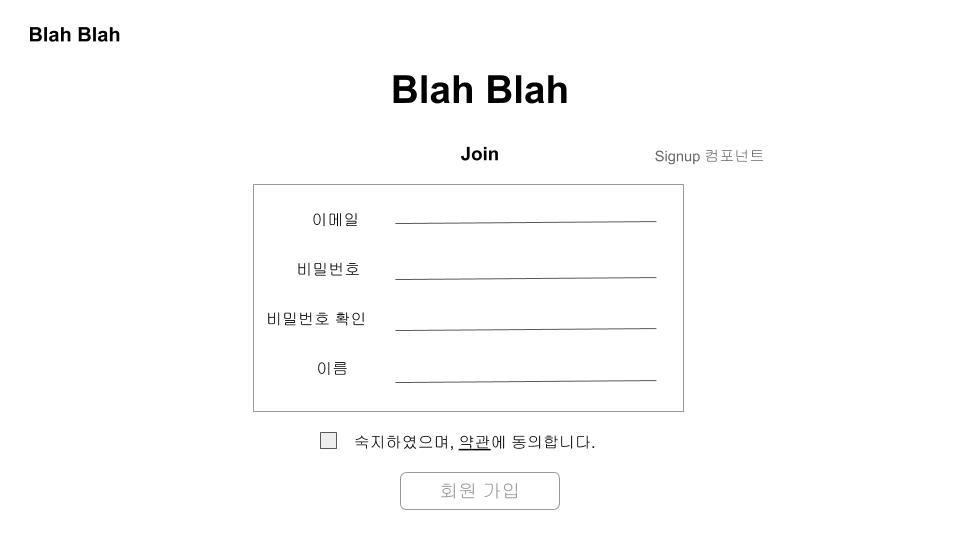
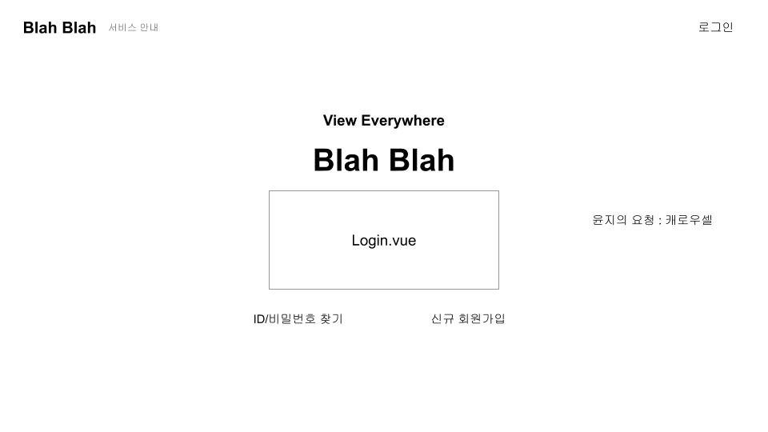
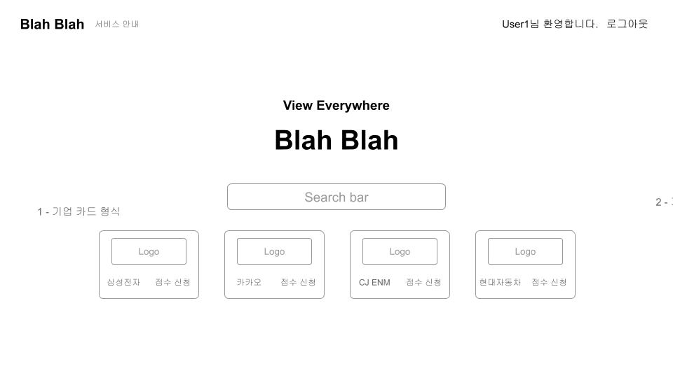
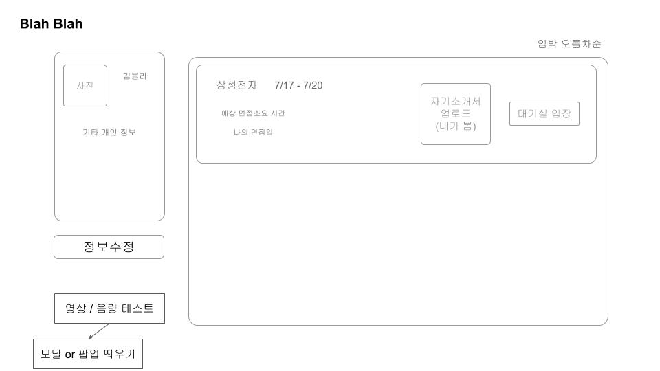

## README.md

### 2021-01-18

### 컬러, 폰트 선정

> 컬러 헥사코드, 폰트 (https://noonnu.cc/index)  후보군 선정

**미리보기 : [링크](https://docs.google.com/presentation/d/1bTWq6ZAFRx_eYOPpqDBn2YZLXNS_-_yzFIarplIu13I/edit#slide=id.gb70b362a57_0_816)**

### 와이어프레임

> Adobe XD, Google Presentation 활용

**구글 프레젠테이션 : [링크](https://docs.google.com/presentation/d/11VgR-wVko8yEcZObqm4WCwEN23K29zg0mCRuFgIGlc0/edit#slide=id.p) **

* 회원가입

  

* 메인 & 로그인

  

  

* 프로필

  

